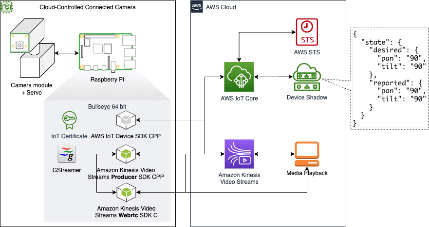
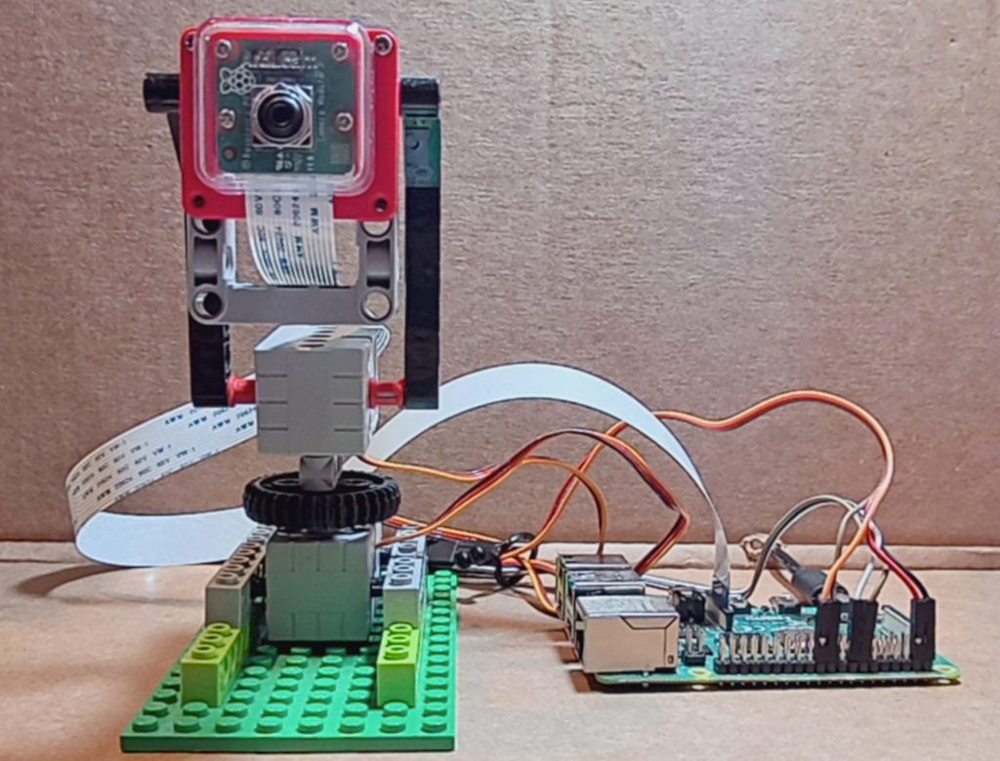

# Cloud Controlled Connected Camera with AWS IoT Services
Demo assets and instructions to integrate Raspberry camera module with AWS cloud using AWS IoT services.

## Components
Requires an AWS account and below components.

| Component | Quantity | Description |
| --- | --- | --- |
| Raspberry Pi | 1 | Raspberry Pi 3 or [Raspberry Pi 4B](https://www.raspberrypi.com/products/raspberry-pi-4-model-b/)(preferred) |
| Raspberry Pi Camera Module | 1 | [Raspberry Pi Camera Module 3](https://www.raspberrypi.com/products/camera-module-3/) |
| Servo compatible with LEGOeds | 2 | [Sparkleiot 2kg 360 Degree Rotation Servo](https://a.co/d/8iiJeyW) |
| Parts from LEGO Technic | 1 | [LEGO parts inventory](./docs/images/lego_technic_parts.png)|
| Jumper Wires | 6 | [Jumper wire male to female](https://www.amazon.com/s?k=jumper+wires+male+to+female)|
| Raspberry Pi Camera Cable | 1 | [12" Raspberry Pi Camera Cable](https://a.co/d/h6dZytU) |

## What does this repo do?
This repository contains sample codes and helper scripts that you can use to integrate your camera module with AWS Cloud. Three AWS SDKs are used.
- [Amazon Kinesis Video Streams Producer SDK for C++](https://github.com/awslabs/amazon-kinesis-video-streams-producer-sdk-cpp): Used to stream video to AWS cloud.
- [Amazon Kinesis Video Streams C WebRTC SDK](https://github.com/awslabs/amazon-kinesis-video-streams-webrtc-sdk-c): Used to stream video using AWS cloud.
- [AWS IoT Device SDK for C++ v2](https://github.com/aws/aws-iot-device-sdk-cpp-v2): Used to control the camera stand using a device shadow.

This will create two executables:
- c3-camera-producer: Send video using Amazon Kinesis Video Streams Producer SDK while letting you control your camera stand using AWS IoT Device SDK.
- c3-camera-webrtc: Send video using Amazon Kinesis Video Streams WebRTC SDK while letting you control your camera stand using AWS IoT Device SDK.



## Steps to run the application

### Step1: Build Camera Stand
#### LEGO build instruction
To make the demo more interesting, the camera stand will be built using LEGO bricks and Servos compatible with LEGOeds.


Link to [step-by-step instructions](./docs/camera_stand_lego_build_instruction.pdf)

##### Cabling
A handy reference of GPIO pinout can be accessed on the Raspberry Pi by running the command pinout. 
Camrea cabling instructions can be found here: https://picamera.readthedocs.io/en/latest/quickstart.html.
GeekServo 2KG Servo has a three-pin connector.
- Brwon: GND
- Red: VCC
- Yellow: Signal
```shell
pi@rpi4-demo:~ $ pinout
,--------------------------------.
| oooooooooooooooooooo J8   +======
| 1ooooooooooooooooooo  PoE |   Net
|  Wi                    1o +======
|  Fi  Pi Model 4B  V1.4 oo      |
|        ,----. +---+         +====
| |D|    |SoC | |RAM|         |USB3
| |S|    |    | |   |         +====
| |I|    `----' +---+            |
|                   |C|       +====
|                   |S|       |USB2
| pwr   |hd|   |hd| |I||A|    +====
`-| |---|m0|---|m1|----|V|-------'

J8:
   3V3  (1) (2)  5V         <-- Servo2(for TILT) Red
 GPIO2  (3) (4)  5V             <-- Servo1(for PAN) Red
 GPIO3  (5) (6)  GND
 GPIO4  (7) (8)  GPIO14
   GND  (9) (10) GPIO15
GPIO17 (11) (12) GPIO18
GPIO27 (13) (14) GND        <-- Servo2 Brown
GPIO22 (15) (16) GPIO23     <-- Servo2 Yellow
   3V3 (17) (18) GPIO24
GPIO10 (19) (20) GND            <-- Servo1 Brown
 GPIO9 (21) (22) GPIO25         <-- Servo1 Yellow
GPIO11 (23) (24) GPIO8
   GND (25) (26) GPIO7
 GPIO0 (27) (28) GPIO1
 GPIO5 (29) (30) GND
 GPIO6 (31) (32) GPIO12
GPIO13 (33) (34) GND
GPIO19 (35) (36) GPIO16
GPIO26 (37) (38) GPIO20
   GND (39) (40) GPIO21
```
The setup in my environment looks like below. I used male to female jumper wires to connect the Servos to the GPIO pins of a Raspberry Pi.


### Step2: Raspberry Pi Setup
#### Install OS
Install Raspberry Pi OS(bullseye 64bit) on the SD car by following [this guide](https://catalog.workshops.aws/aws-iot-immersionday-workshop/en-US/aws-greengrassv2/greengrass-physicaldevice/lab37-rpi-greengrass-basics#step-1:-install-raspberry-pi-os-on-the-sd-card).

Additionally, it is encouraged to update your Raspberry Pi and to verify that the git utility is installed prior to proceeding:

```
sudo apt update
sudo apt install git -y
```

#### Configure Raspberry Pi
Run raspi-config command and change configurations.
- Enable legacy camera
- Enable VNC
- Set VNC resolution to your desired resolution
```shell
sudo raspi-config
```

Edit /boot/config.txt to apply the below configuration changes.
```shell
sudo vi /boot/config.txt

#### changes

hdmi_force_hotplug=1
hdmi_group=2
hdmi_mode=51
[pi4]
dtoverlay=vc4-fkms-v3d
camera_auto_detect=1
```

Reboot the Raspberry Pi and run the below command to check if the camera has been detacted.

**Command**
```shell
sudo vcgencmd get_camera
```
**Output**
```shell
supported=1 detected=0, libcamera interfaces=1
```
**Command**
```shell
libcamera-hello --list-cameras
```
**Output**
```shell
Available cameras
-----------------
0 : imx708 [4608x2592] (/base/soc/i2c0mux/i2c@1/imx708@1a)
    Modes: 'SRGGB10_CSI2P' : 1536x864 [120.13 fps - (768, 432)/3072x1728 crop]
                             2304x1296 [56.03 fps - (0, 0)/4608x2592 crop]
                             4608x2592 [14.35 fps - (0, 0)/4608x2592 crop]
```

#### Install development and runtime dependencies
Installs development and runtime dependencies for the SDK. 
```shell
sudo apt update
sudo apt install -y \
  automake \
  build-essential \
  cmake \
  git \
  gstreamer1.0-plugins-base-apps \
  gstreamer1.0-plugins-bad \
  gstreamer1.0-plugins-good \
  gstreamer1.0-plugins-ugly \
  gstreamer1.0-tools \
  libcurl4-openssl-dev \
  libgstreamer1.0-dev \
  libgstreamer-plugins-base1.0-dev \
  liblog4cplus-dev \
  libssl-dev \
  pkg-config
```

Verify the GStreamer installation by checking help.
```shell
gst-launch-1.0 -h
```

Let's test encoding by saving video to a file after encoding it with v4l2h264enc encoder.
```shell
gst-launch-1.0 libcamerasrc ! \
capsfilter caps="video/x-raw,width=1280,height=720,format=NV12,framerate=30/1,interlace-mode=(string)progressive,colorimetry=bt709" ! \
clockoverlay time-format="%d/%m/%y %H:%M:%S" ! v4l2h264enc extra-controls="controls,h264_profile=4,video_bitrate=620000" ! \
"video/x-h264,level=(string)4" ! h264parse ! matroskamux ! filesink location=output.mkv
```

### Step3: Register Camera as a thing
#### Obtain AWS credentials
The scripts in this project make use of the AWS CLI in order to provision resources into your AWS account. To use these scripts, create a temporary AWS key pair and set these as environment variables on your Pi. These will only be used to provision your initial set of AWS Cloud resources and can be discarded after the subsequent steps have successfully completed. Follow these instructions to create an AWS access key: https://repost.aws/knowledge-center/create-access-key.

Then, set your AWS access key as environment variables in your Raspberry Pi device:

```
export AWS_ACCESS_KEY_ID=<AWS account access key>
export AWS_SECRET_ACCESS_KEY=<AWS account secret key>
export AWS_DEFAULT_REGION=<AWS region>
```

#### Colne this repository and run setup script

To download the repository, run the following command:

```shell
cd ~/dev
git clone https://github.com/aws-samples/cloud-controlled-connected-camera-with-aws-iot-services.git
```

Run the easy install script. Please note that this script will install AWS CLI on your Raspberry Pi, and will also provision AWS Cloud resources on your behalf.

The `easy_install` script can be passed the AWS IoT Core Thing Name as an argument. If you do not set this, the script will prompt and wait for you to enter a Thing Name before proceeding. 

```shell
cd cloud-controlled-connected-camera-with-aws-iot-services
./easy_install.sh YOUR_THING_NAME
```
### Step4: Verify the installation
Verify that the script-output folder contains x.509 certificates.

**Command**
```shell
ls script-output/iot/certs
```
**Output**
```
device.cert.pem    device.private.key device.public.key  root-CA.pem
```

### Step5: Run program
#### Build
CMake provides a number of ways to put dependency on AWS SDKs into the build. Below two are the options explained in [Using Dependencies Guide](https://cmake.org/cmake/help/latest/guide/using-dependencies/index.html) of CMake documentation.
 - [Using Pre-built Packages With find_package()](https://cmake.org/cmake/help/latest/guide/using-dependencies/index.html#using-pre-built-packages-with-find-package)
   - Sample: [Debugging C/C++ AWS IoT Greengrass Components using VSCode](https://dev.to/iotbuilders/debugging-cc-greengrass-components-using-vscode-1nbh)
 - [Downloading And Building From Source With FetchContent](https://cmake.org/cmake/help/latest/guide/using-dependencies/index.html#downloading-and-building-from-source-with-fetchcontent)
   - Sample: [aws-samples / amazon-kinesis-video-streams-demos / canary](https://github.com/aws-samples/amazon-kinesis-video-streams-demos/blob/master/canary/producer-cpp/CMakeLists.txt)
 
The 2nd method is used so that the used AWS SDKs are built from sources as part of the main project. It is recommended to read the [Using Dependencies Guide](https://cmake.org/cmake/help/latest/guide/using-dependencies/index.html) to understand the dependency mangement better.

Create a build directory, and execute CMake from it.
```shell
mkdir -p ~/dev/cloud-controlled-connected-camera-with-aws-iot-services/build
cd ~/dev/cloud-controlled-connected-camera-with-aws-iot-services/build
cmake ..
cmake --build .
```

#### Running the application
> [!NOTE]
> This application should be run as a root user due to the requirement of [pigpio](http://abyz.me.uk/rpi/pigpio/) library.

If you created necessary resources using `easy-install.sh` by following this guide, you will find the `run-c3-camera.sh` in the project's root directory. The `run-c3-camera.sh` requires DEMO type as an argument.
- producer
- webrtc

Below example will execute `c3-camera-webrtc` which sends video using Amazon Kinesis Video Streams WebRTC SDK.
```shell
cd ~/dev/cloud-controlled-connected-camera-with-aws-iot-services
./run-c3-camera.sh webrtc
```

## Demo


## References

- [aws-iot-device-sdk-cpp-v2/samples](https://github.com/aws/aws-iot-device-sdk-cpp-v2/tree/main/samples/shadow/shadow_sync)
- [amazon-kinesis-video-streams-demos/canary](https://github.com/aws-samples/amazon-kinesis-video-streams-demos/tree/master/canary/producer-cpp)
- [Debugging C/C++ AWS IoT Greengrass Components using VSCode](https://dev.to/iotbuilders/debugging-cc-greengrass-components-using-vscode-1nbh)
- [Install GStreamer 1.18 on Raspberry Pi 4](https://qengineering.eu/install-gstreamer-1.18-on-raspberry-pi-4.html)
- [GStreamer C++ Tutorial](https://www.it-jim.com/blog/gstreamer-cpp-tutorial/)

## Security

See [CONTRIBUTING](CONTRIBUTING.md#security-issue-notifications) for more information.

## License

This project is licensed under the Apache-2.0 License.